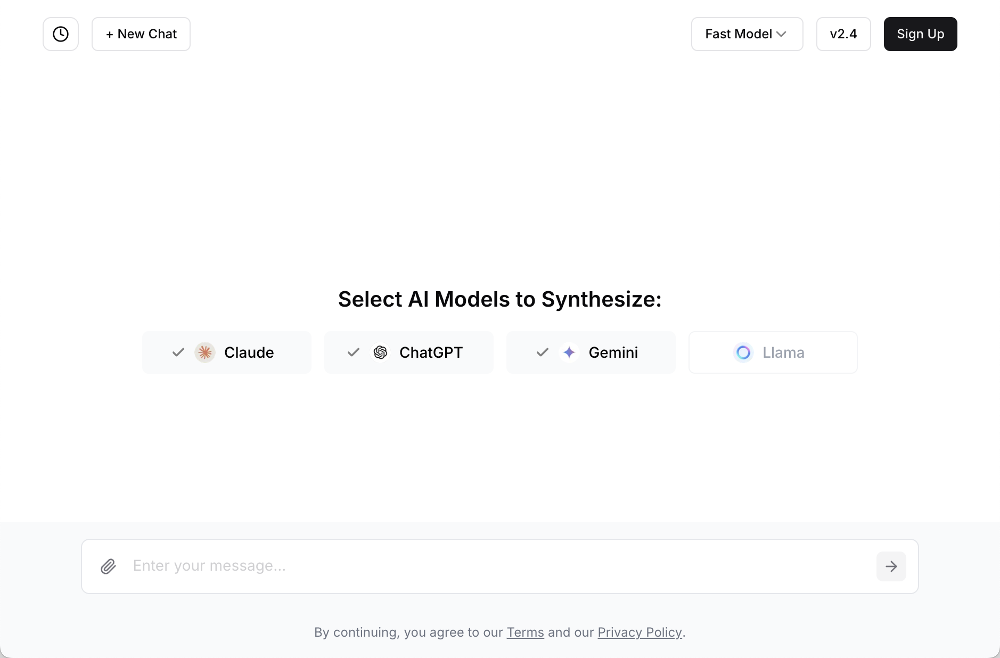

# ✨ **ManyAI** - Multi-Model AI Platform

<div align="center">
  <p><em>Experience the power of multiple AI models in a single, elegant interface</em></p>

  
  
  
  

  
</div>

<div align="center">
  
  <p><em>ManyAI's intuitive multi-model interface in action</em></p>
</div>

---

## 🚀 **What is ManyAI?**

ManyAI is a cutting-edge multi-model AI platform that allows users to interact with multiple state-of-the-art AI models simultaneously. Get diverse perspectives, compare responses, and experience the future of AI conversation through our intuitive interface.

### 🎯 **Key Highlights**
- **Multi-Model Experience**: Chat with Claude, ChatGPT, Gemini, and Llama models simultaneously
- **Smart & Fast Modes**: Choose between optimized response speed or enhanced reasoning
- **Real-time Streaming**: Watch responses unfold in real-time with smooth streaming
- **Intelligent Fusion**: Get synthesized responses that combine the best of all models
- **Conversation Memory**: Maintain context across the entire conversation for all models
- **Mobile-First Design**: Seamless experience across desktop and mobile devices

---

## 🏗️ **Architecture & Tech Stack**

### **Frontend**
- **Framework**: Next.js 14 with App Router
- **Language**: TypeScript 5.0
- **Styling**: Tailwind CSS + shadcn/ui components
- **State Management**: React hooks with localStorage persistence
- **Animations**: Framer Motion for smooth interactions
- **Analytics**: Amplitude for user tracking and session replay

### **Backend & APIs**
- **API Routes**: Next.js API routes for server-side processing
- **Database**: Supabase (PostgreSQL) for conversation logging
- **Authentication**: Supabase Auth with email/password
- **Real-time**: Server-Sent Events (SSE) for streaming responses

### **AI Providers**
- **Anthropic**: Claude 3 Haiku (Fast) & Claude 3.5 Sonnet (Smart)
- **OpenAI**: GPT-4o, GPT-4o Mini, O1 Mini
- **Google**: Gemini 1.5 Pro & Gemini 1.5 Flash
- **Together AI**: Llama 3.2 models (90B & 11B Vision)
- **Groq**: High-speed Llama inference
- **DeepInfra**: Additional Llama model access

---

## 🚀 **Quick Start**

### **Prerequisites**
- Node.js 18+ and npm/yarn/pnpm
- Supabase account for database
- API keys for AI providers

### **Installation**

```bash
# Clone the repository
git clone <repository-url>
cd project

# Install dependencies
npm install

# Set up environment variables
cp .env.example .env.local
# Add your API keys and database credentials

# Run the development server
npm run dev
```

Open [http://localhost:3000](http://localhost:3000) to start chatting with multiple AI models!

### **Environment Variables**
```env
# Supabase
NEXT_PUBLIC_SUPABASE_URL=your_supabase_url
SUPABASE_SERVICE_ROLE_KEY=your_service_role_key

# AI Provider API Keys
ANTHROPIC_API_KEY=your_anthropic_key
OPENAI_API_KEY=your_openai_key
GOOGLE_API_KEY=your_google_key
TOGETHER_API_KEY=your_together_key
GROQ_API_KEY=your_groq_key
DEEP_INFRA_API_KEY=your_deepinfra_key

# Analytics
NEXT_PUBLIC_AMPLITUDE_API_KEY=your_amplitude_key
```

---

## 🎨 **Features**

### **🤖 Multi-Model Chat**
- Simultaneously query multiple AI models with a single prompt
- Compare different AI perspectives and reasoning approaches
- Switch between Fast and Smart modes for optimal performance

### **🔄 Intelligent Response Fusion**
- Automatically synthesize responses from all models
- Choose between synthesis, creation, or follow-up modes
- Get the best insights combined into a single coherent response

### **💾 Conversation Management**
- Persistent conversation history for each model
- Context preservation across all interactions
- New chat functionality to start fresh conversations

### **📱 Responsive Design**
- Desktop grid layout with detailed model comparison
- Mobile carousel interface for touch-friendly browsing
- Adaptive UI that works seamlessly across all devices

### **🔐 User Authentication**
- Secure email/password authentication via Supabase
- Password reset functionality
- Protected routes and user session management

### **📊 Analytics & Monitoring**
- User interaction tracking with Amplitude
- Session replay for debugging and optimization
- Geographic restrictions and compliance features

---

## 🏭 **Deployment**

### **Vercel (Recommended)**
```bash
# Deploy to Vercel
npm run build
vercel --prod
```

The application is optimized for Vercel deployment with:
- Automatic environment variable handling
- Edge runtime compatibility
- Optimized build configuration in `vercel.json`

### **Other Platforms**
```bash
# Build for production
npm run build

# Start production server
npm start
```

---

## 🔧 **Development**

### **Available Scripts**
```bash
npm run dev        # Start development server
npm run build      # Build for production
npm run start      # Start production server
npm run lint       # Run ESLint
```

### **Project Structure**
```
src/
├── app/                 # Next.js App Router
│   ├── api/            # API routes
│   ├── auth/           # Authentication pages
│   └── dashboard/      # Protected dashboard
├── components/         # React components
│   ├── ui/            # Reusable UI components
│   └── pages/         # Page-specific components
├── config/            # Configuration files
├── lib/               # Utility libraries
└── types/             # TypeScript type definitions
```

### **Key Components**
- **`src/app/page.tsx`**: Main chat interface with multi-model support
- **`src/app/api/generate/route.ts`**: AI model API integration and streaming
- **`src/config/models.ts`**: AI provider and model configuration
- **`src/components/pages/resultcard.tsx`**: Individual model response display

---

## 🤝 **Contributing**

We welcome contributions! Please see our [Contributing Guidelines](CONTRIBUTING.md) for details on:
- Code style and standards
- Pull request process
- Issue reporting
- Development workflow

---

## 📄 **License**

This project is licensed under the MIT License - see the [LICENSE.md](LICENSE.md) file for details.

---

## 🔗 **Links**

- **Live Demo**: [https://manyai.co](https://manyai.co)

---

<div align="center">
  <p><strong>Built with ❤️ by William from Singapore</strong></p>
  <p><em>Bringing multiple AI minds and synthesizing the ideas</em></p>
</div>
